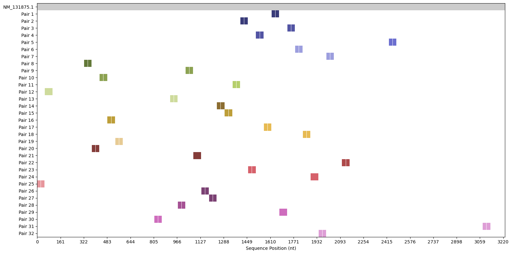

Pybridizer is a python repository to generate HCR v3.0 probes for in situ hybridization of mRNA. 

The module allows for quick and easy design of probe pairs for the Hybridization Chain Reaction approach (Choi et al. Development 2018.)


You can install the Pybridizer HCR probe design tool by first creating a virtual environment using conda:

```
conda create --name pyrbidize python
conda activate pybridize
```

You can then use pip to install the HCR probe design tool:

```
pip install pybridizer
```


Dependencies: BLAST+

Install BLAST+ by downloading executable from https://ftp.ncbi.nlm.nih.gov/blast/executables/blast+/LATEST/


To build a BLAST database, use the BLAST+ 'makeblastdb' command. 

Detailed instructions are available on the NIH website at https://www.ncbi.nlm.nih.gov/books/NBK569841/


Once the database is built, you can use Pybridizer to generate HCR probes for any transcript sequence for any species.

The pybridizer_basic_usage.ipynb notebook in the examples folder provides a step-by-step guide for designing probes.

You can also visualize the alignment of the generated probes to the target sequence and store the alignment data in a FASTA file.



